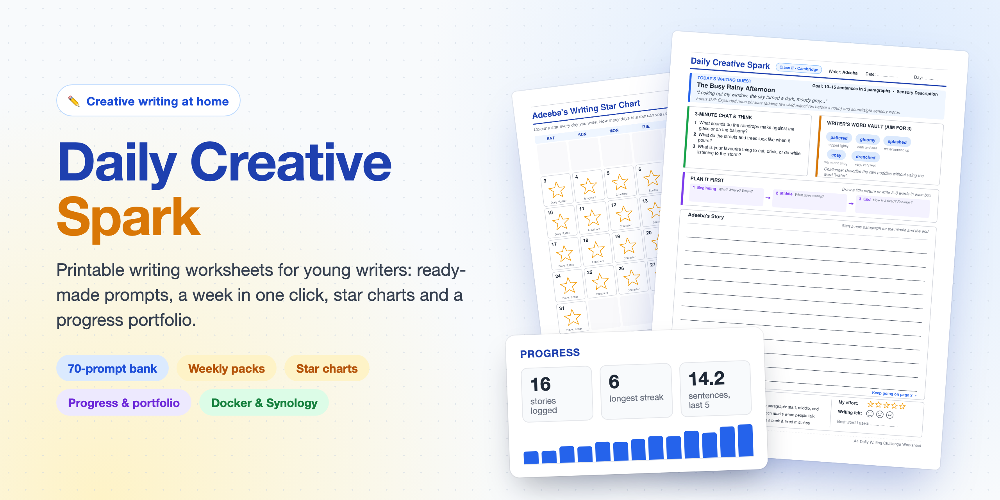
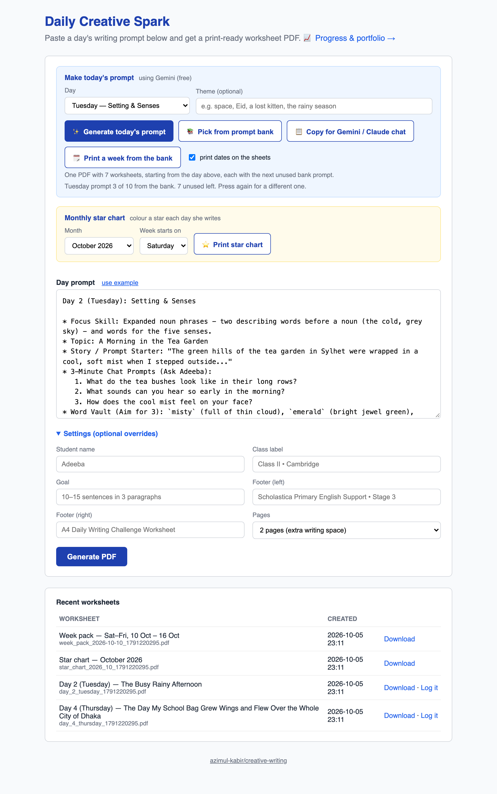
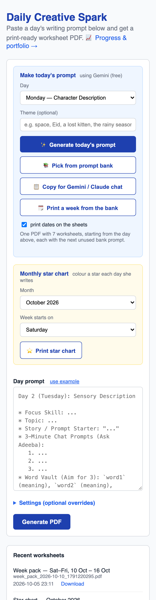
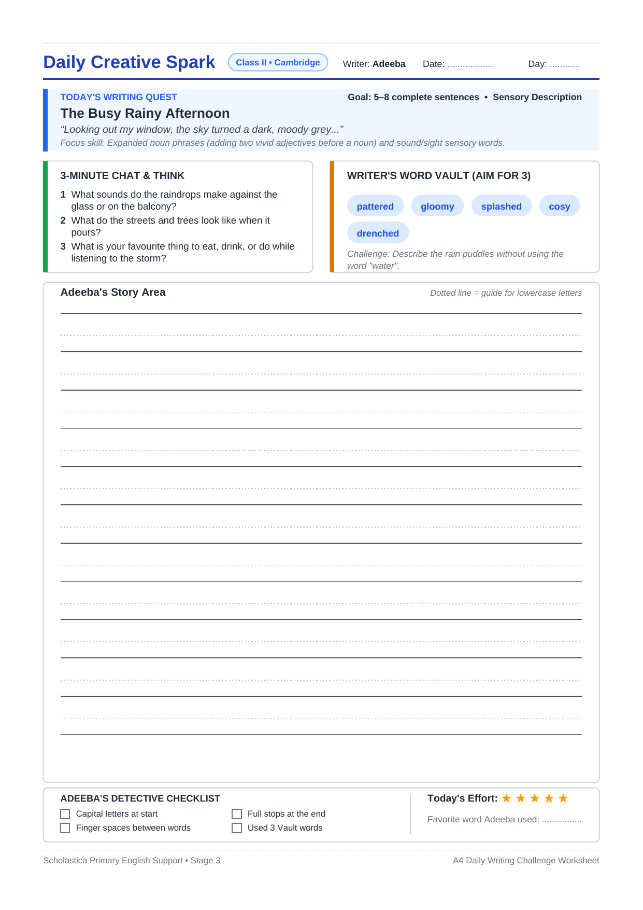
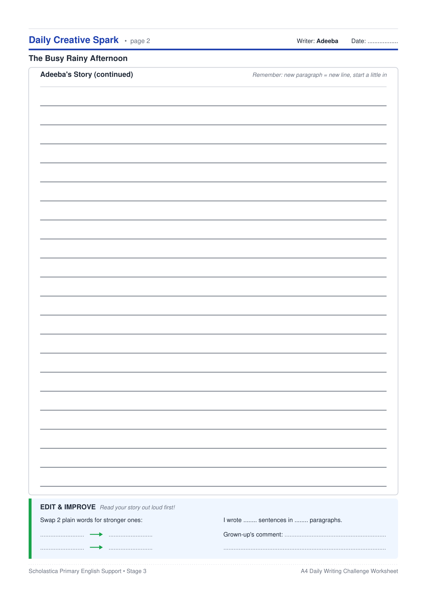
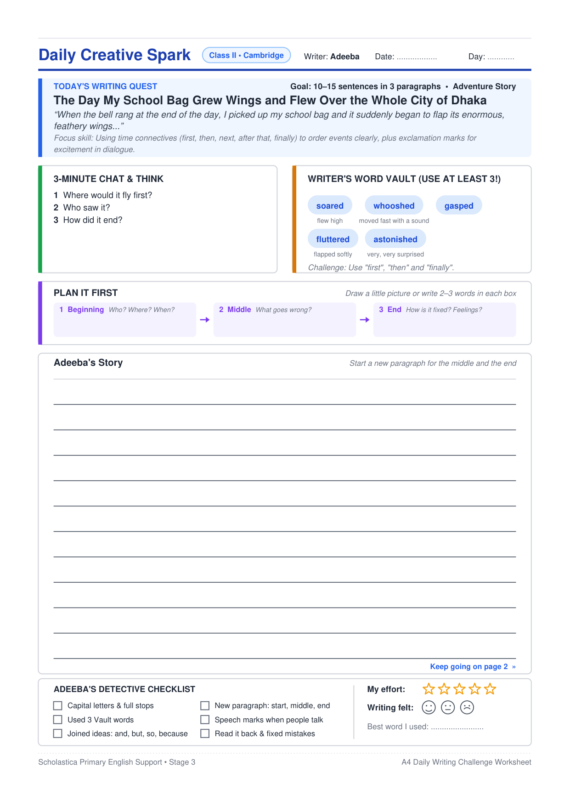
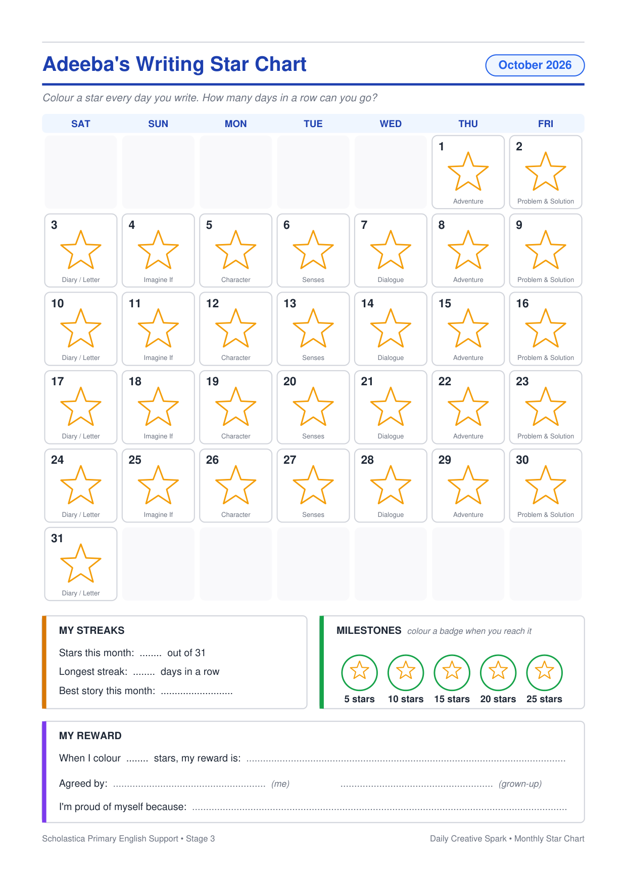
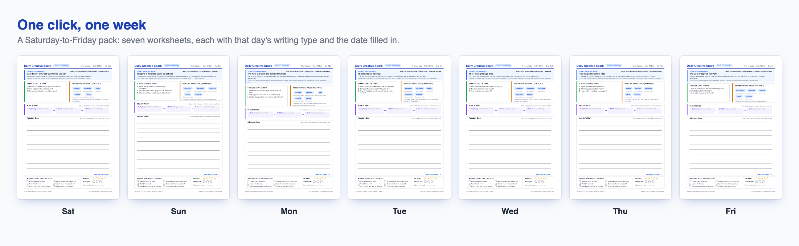
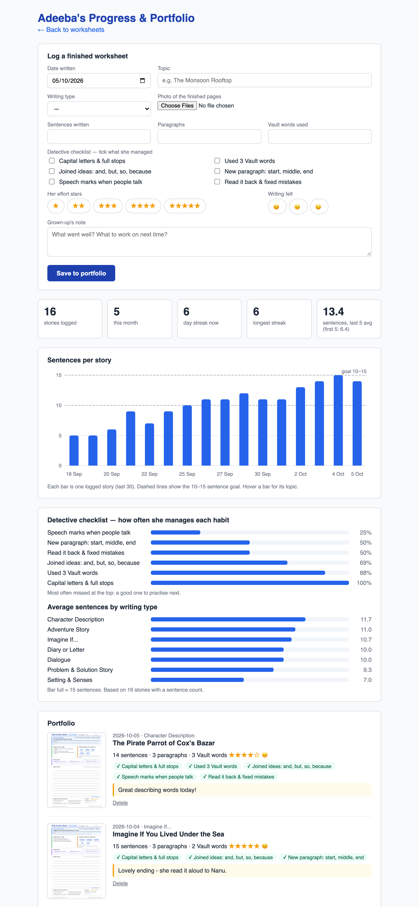

<p align="center">
  
</p>

# creative-writing — Daily Creative Spark

A small home web app that makes printable **creative-writing worksheets**
for a young writer, and keeps track of how she's getting on. It's set up for
an 8-year-old in Class II at a Cambridge curriculum school in Dhaka
(Cambridge Primary English, Stage 3), but the name, class, goal and prompts
are all configurable.

It runs in Docker on a Synology NAS (or anywhere Docker runs) and is used
from a laptop or phone on the home network.

**What it does**

- **Two-page A4 worksheets.** Each has a writing quest, chat questions, a
  Word Vault with child-friendly meanings, a *Plan it first* strip, lined
  writing space, a Stage 3 checklist, and stars and faces she colours in
  herself.
- **Prompts without the effort.** A **built-in bank of 70 prompts** (10
  weeks, free and offline). Or generate one with **Gemini** (free key) or
  **Claude**, or copy a ready-made request into the Gemini or Claude chat
  app.
- **A whole week in one click.** One PDF with 7 worksheets, dates filled
  in.
- **A monthly star chart** to colour in, with streaks, milestones and a
  reward.
- **Progress & portfolio.** Log each finished sheet with a photo; see
  streaks, a sentences-per-story chart, and which writing habits need
  practice.

## Screenshots

**The web app.** Pick a day, fill the prompt from the bank (or Gemini,
Claude or copy-paste), and press *Generate PDF*. Or print a whole week, or
the month's star chart. Everything you make is listed under *Recent
worksheets*.

<p align="center">
  
</p>

It works on a phone too; the layout collapses to a single column:

<p align="center">
  
</p>

**The worksheets.** Two A4 pages each, pitched at age 8–9:

- **Page 1:** the writing quest, chat questions, the Word Vault with
  meanings, *Plan it first* (Beginning → Middle → End), the start of the
  story, the Detective checklist, and stars and faces to colour.
- **Page 2:** a full page of lines to carry on, plus an *Edit & improve*
  box (swap two plain words, count sentences and paragraphs, and a line
  for a grown-up's comment).

<table>
  <tr>
    <td align="center" width="50%">
      
      <br><sub>Page 1 — <code>examples/day2_prompt.txt</code></sub>
    </td>
    <td align="center" width="50%">
      
      <br><sub>Page 2 — more writing space</sub>
    </td>
  </tr>
  <tr>
    <td align="center" width="50%">
      
      <br><sub><code>examples/day4_prompt.txt</code> — long lines wrap</sub>
    </td>
    <td align="center" width="50%">
      
      <br><sub>Monthly star chart</sub>
    </td>
  </tr>
</table>

**A week in one click.** Seven worksheets in one PDF, each with that day's
writing type and the date filled in:

<p align="center">
  
</p>

**Progress & portfolio.** Log each finished sheet and watch her writing grow:

<p align="center">
  
</p>

## A typical week

1. **At the weekend:** pick **Saturday** as the day and press **Print a
   week from the bank**. Print double-sided and you have one sheet of
   paper per day, with the dates already on. At the start of the month,
   also print the **star chart**.
2. **Each day:** spend 3 minutes on the chat questions, then she plans,
   writes, ticks her checklist and colours her stars and face. Then she
   colours today's star on the chart.
3. **After writing:** take a photo and **log it** on the Progress page.
   Use the *Log it* link next to the worksheet in *Recent worksheets*.
4. **Now and then:** look at the Progress page. The checklist rates show
   which habit to practise next.

## Making the day's prompt

The **Make today's prompt** box at the top of the main page:

1. **Pick the day.** It defaults to today, and each day has its own
   writing focus, so a week works through a mix of Stage 3 skills:

   | Day | Writing type | Skill practised |
   |---|---|---|
   | Monday | Character Description | describing looks and personality, giving reasons with *because* |
   | Tuesday | Setting & Senses | two describing words before a noun; sight, sound, smell, touch, taste |
   | Wednesday | Dialogue | speech marks; stronger words than *said* |
   | Thursday | Adventure Story | time connectives (*first, then, finally*); exclamation marks |
   | Friday | Problem & Solution Story | three paragraphs joined with *and, but, so, because* |
   | Saturday | Diary or Letter | first person, past tense, feelings |
   | Sunday | Imagine If... | questions and exclamations |

2. Optionally type a **theme** (space, Eid, a lost kitten...). The prompt
   bank ignores themes.
3. Then pick one of these:
   - **📚 Pick from prompt bank** (free, offline, instant). Fills in the
     next unused ready-written prompt for that day. Press it again for a
     different one. See [The prompt bank](#the-prompt-bank).
   - **✨ Generate today's prompt** (needs an API key, see
     [API keys](#api-keys-optional)). The page shows a counter while it
     works and fills the prompt box in by itself, usually within a minute.
   - **📋 Copy for Gemini / Claude chat** (no key needed). Copies a
     ready-made request. Paste it into the Gemini app or claude.ai (your
     subscription covers that), then paste the reply's code block back
     into the prompt box.
4. Read it over, edit anything, then press **Generate PDF**. It opens in a
   new tab, ready to print.

Every route gives a topic, story starter, chat questions, Word Vault words
*with meanings*, and a Star Challenge, written for an 8-year-old in Dhaka:
everyday Bangladeshi life mixed with fantasy and adventure, in British
spelling. Generated prompts avoid topics from your recent worksheets. The
requests sent to Gemini or Claude never include her name or school; the
name is only added on the NAS.

### The prompt bank

`prompt_bank.json` holds **70 ready-written prompts**, 10 for each weekday,
so it covers 10 weeks. They range from Nanu's kitchen, a Sylhet tea garden
and the Shakrain kite battle to a talking mango tree and a picnic on the
Moon.

- The bank hands out the **next unused** prompt for the chosen day. When a
  day's 10 have all been used, that day starts again from the first.
- Used prompts are remembered in `data/prompt_bank_used.json`, so the order
  survives restarts. Delete that file to start the whole bank over.
- **To add prompts,** append entries to `prompt_bank.json` with a new unique
  `id` (same fields as the others), then rebuild.

### Weekly pack

**🗓️ Print a week from the bank** makes **one PDF with 7 worksheets**,
starting from the day in the *Day* picker (pick Saturday for a
Saturday-to-Friday school week).

- Each sheet gets the next unused bank prompt for its day.
- With **print dates on the sheets** ticked, the Date and Day boxes are
  filled in on both pages (e.g. "Date: 11 Oct · Day: Sat"), starting from
  the next occurrence of the chosen day.
- It uses your Settings, so with 2 pages per sheet it's 14 pages.

### API keys (optional)

Only needed for **Generate today's prompt**. Put a key in a file called
`.env` next to `docker-compose.yml` (it's git-ignored, so keys never reach
GitHub), then rebuild with `docker compose up -d --build`:

```
# free: create one at https://aistudio.google.com/apikey
GEMINI_API_KEY=...
```

- **Gemini** (`GEMINI_API_KEY`) is **free**.
  - On the free tier, Google may use requests to improve its products, and
    at busy times the free models can be overloaded ("high demand").
  - The app tries `gemini-3.8-flash`, then `gemini-3.7-flash`, then
    `gemini-3.5-flash`. Each model gets up to 40 seconds (the last gets
    whatever is left), within a 2-minute total (`PROMPT_TIMEOUT`).
  - Generation runs in the background while the page checks back, so a
    slow reply isn't cut off by a reverse proxy.
  - If every model is busy, you'll see a message; use the bank or
    copy-for-chat instead.
- **Claude** (`ANTHROPIC_API_KEY`, from
  [console.anthropic.com](https://console.anthropic.com)) is paid,
  separately from a Claude Pro subscription: roughly 5–10 US cents a prompt
  with the default model.

If both keys are set, Gemini is used unless `PROMPT_PROVIDER=claude`.

## Monthly star chart

In the **Monthly star chart** box, pick the month (this month or one of the
next two) and the day your week starts on (Saturday, Sunday or Monday), then
press **⭐ Print star chart**. You get one A4 page:

- **A calendar for the month.** Each day has an empty star to colour on
  days she writes, plus that weekday's writing type.
- **My Streaks:** stars this month, longest streak, and best story.
- **Milestones:** badges at 5, 10, 15, 20 and 25 stars to colour in.
- **My Reward:** "When I colour __ stars, my reward is __", signed by her
  and a grown-up, plus "I'm proud of myself because…".

## Progress & portfolio

**📈 Progress & portfolio** (link at the top of the main page) is for
keeping track over the term.

**Log a finished worksheet:**
- the date and topic (recent topics are suggested as you type) and the
  writing type;
- a **photo of the pages** (on a phone this offers the camera);
- sentences, paragraphs and Vault words used;
- which **Detective checklist** habits she managed;
- her own **stars** and **face**, and a note from you.

The **Log it** link beside a worksheet in *Recent worksheets* opens the form
with its topic and writing type filled in.

**At a glance:**
- stories logged, this month, current and longest streak;
- average sentences in her last 5 stories, compared with her first 5;
- a chart of sentences per story, with the 10–15 goal marked (hover a bar
  for its topic);
- how often she manages each checklist habit, most-missed first;
- average sentences by writing type.

**The portfolio** keeps every story, newest first, with its photos, numbers,
checklist ticks and your note. Tap a photo for full size; entries can be
deleted, and their photos go with them.

## Settings

The **Settings** panel on the main page overrides the name, class label,
goal, footers and pages for one worksheet, week pack or chart. The defaults
come from environment variables (set in `docker-compose.yml`):

| Variable | Default | What it does |
|---|---|---|
| `STUDENT_NAME` | `Adeeba` | Name on worksheets, charts and the Progress page |
| `CLASS_LABEL` | `Class II • Cambridge` | The badge in the worksheet header |
| `DEFAULT_GOAL` | `10–15 sentences in 3 paragraphs` | The goal in the quest box |
| `PAGES` | `2` | `2` adds the full writing page; `1` is a single sheet |
| `FOOTER_LEFT` / `FOOTER_RIGHT` | school / "A4 Daily Writing Challenge Worksheet" | Page footers |
| `GEMINI_API_KEY` | (none) | Turns on Generate with Gemini (free) |
| `GEMINI_MODEL` | `gemini-3.8-flash,gemini-3.7-flash,gemini-3.5-flash` | Models to try, in order |
| `ANTHROPIC_API_KEY` | (none) | Turns on Generate with Claude (paid) |
| `CLAUDE_MODEL` | `claude-opus-5-5` | Claude model |
| `PROMPT_PROVIDER` | (auto) | `claude` to prefer Claude when both keys are set |
| `PROMPT_TIMEOUT` | `120` | Seconds allowed for one generated prompt, all models together |
| `TZ` | `Asia/Dhaka` | Time zone, so "today" and the dates are right |
| `OUTPUT_DIR` | `/data` | Where everything is saved (see below) |
| `PORT` | `5000` | Port when running `python3 app.py` |
| `SECRET_KEY` | dev value | Signs the page's one-off messages |

## Your data

Everything the app saves lives in the `data/` folder (mounted at `/data` in
the container), so it survives restarts and rebuilds. **Back up `data/`**:

| Path | What it is |
|---|---|
| `*.pdf` + `*.json` | Recent worksheets, week packs and star charts (the last 30), each with a small sidecar file giving its title |
| `prompt_bank_used.json` | Which bank prompts have been used |
| `progress.db` | Progress entries (a SQLite database) |
| `portfolio/` | Photos of finished worksheets |
| `.jobs/` | Short-lived status files for prompts being generated (cleared after an hour) |

Photo uploads are limited to 40 MB at a time.

## The prompt format

You can also write or paste a prompt yourself. It looks like this (field
order doesn't matter, but keep the `* Label:` bullets):

```
Day 2 (Tuesday): Sensory Description

* Focus Skill: Expanded noun phrases (adding two vivid adjectives before a noun) and sound/sight sensory words.
* Topic: The Busy Rainy Afternoon
* Story / Prompt Starter: "Looking out my window, the sky turned a dark, moody grey..."
* 3-Minute Chat Prompts (Ask Adeeba):
   1. What sounds do the raindrops make against the glass or on the balcony?
   2. What do the streets and trees look like when it pours?
   3. What is your favourite thing to eat, drink, or do while listening to the storm?
* Word Vault (Aim for 3): `pattered` (tapped lightly), `gloomy` (dark and sad), `splashed` (water jumped up), `cosy` (warm and snug), `drenched` (very, very wet)
* Star Challenge (Optional): Describe the rain puddles without using the word "water".
```

- **Word Vault meanings** are optional. Put a short meaning in brackets
  after a word, `` `drenched` (very, very wet) ``, and it's printed under
  the word's chip. `` `drenched` = very wet `` works too (brackets are
  safer if the meaning has a comma).
- **Long lines are fine.** Long topics, starters and focus skills wrap,
  and the quest box grows to fit.
- **The parser is forgiving.** Label wording can vary (`Story Starter` /
  `Prompt Starter`, `Chat Questions` / `Chat Prompts`, `Challenge` /
  `Bonus Challenge`...). Text pasted from a chat app works as-is: code
  fences, **bold** labels and a "Here's your prompt!" line are ignored.
- **Raw JSON works too:** text starting with `{`, using the fields listed
  at the top of `worksheet.py`.

## Run it locally (no Docker)

```bash
pip install -r requirements.txt
OUTPUT_DIR=./data python3 app.py
# open http://localhost:5000
```

Or make a worksheet straight from the command line, no server needed:

```bash
python3 worksheet.py examples/day2_prompt.txt
# -> day_2_tuesday_worksheet.pdf
```

## Build & run with Docker

```bash
docker compose up -d --build
```

Then open `http://<host>:5000`. Without compose:

```bash
docker build -t creative-writing .
docker run -d --name creative-writing -p 5000:5000 \
  -v "$(pwd)/data:/data" -e STUDENT_NAME="Adeeba" creative-writing
```

## Deploying on a Synology NAS

The easiest path is **Container Manager → Project**, which reads
`docker-compose.yml` directly:

1. Put this folder on the NAS (for example `/docker/creative-writing`). A
   `git clone` over SSH makes updates easy.
2. Optional: create a `.env` file next to `docker-compose.yml` with your
   API key (see [API keys](#api-keys-optional)).
3. Open **Container Manager → Project → Create**. Name it
   `creative-writing`, point **Path** at the folder, and use
   `docker-compose.yml`.
4. Build and start it, then browse to `http://<nas-ip>:5000` from any
   device on your network.

**Updating** after changes are merged:

```bash
cd /docker/creative-writing
git pull
docker compose up -d --build
```

`data/` isn't touched by updates.

**Changing the port:** edit the `ports:` line in `docker-compose.yml` (e.g.
`"8080:5000"`).

**Behind a reverse proxy?** That's fine. Generated prompts run in the
background and the page keeps checking back, so the proxy's request timeout
(Synology's is 60 seconds) doesn't cut them off.

## What's in here

```
app.py                    Flask web app: routes, history, week pack, star chart, progress
worksheet.py              PDF drawing engine + prompt parser (also a CLI)
prompt_bank.py            "Pick from prompt bank": hands out the next unused prompt
prompt_bank.json          the 70 ready-written prompts (10 per weekday)
prompt_generator.py       "Generate today's prompt" (Gemini / Claude) and copy-for-chat
star_chart.py             the printable monthly star chart
progress.py               progress tracker & portfolio: storage, stats, sentences chart
templates/index.html      the main page
templates/progress.html   the Progress & portfolio page
examples/                 sample prompts (day2: the classic; day4: long text)
requirements.txt          Python dependencies
Dockerfile                container image
docker-compose.yml        one-file deploy (works in Synology Container Manager)
docs/                     README hero + screenshots
  hero.html               the hero's source
  make_screenshots.py     regenerates the hero and every screenshot
```

## Customizing

**Worksheet design.** All drawing is in `worksheet.py` (`draw_header`,
`draw_quest_box`, `draw_two_column`, `draw_plan_strip`, `draw_story_area`,
`draw_footer_panel`, and for page 2 `draw_continued_header` and
`draw_edit_panel`). Colours are `HexColor(...)` constants at the top of the
file.

**Per-worksheet options** (via JSON input):

- `plan_labels`: e.g. `["Who?", "Where?", "What happens?"]`, or
  `[["Beginning", "Who? Where?"], ...]` to add a hint after each label, or
  `[]` to hide the plan strip
- `line_spacing_mm`: the gap between writing lines (default 9)
- `guide_lines`: `true` adds a dotted mid-line for letter sizing, for
  younger writers
- `story_lines`: a fixed number of page-1 writing lines (by default it fills
  the space)
- `pages`: `1` or `2`
- `date_text` / `day_name`: fill the header's Date and Day boxes

**The weekly plan** (which skill each weekday practises) and the instructions
for Gemini and Claude are at the top of `prompt_generator.py`. The bank's
parent-facing focus-skill lines are in `prompt_bank.py`.

**Updating the screenshots.** After a visual change, regenerate everything
in `docs/` from demo data (Playwright is only needed for this):

```bash
pip install -r requirements.txt playwright pymupdf
playwright install chromium
python3 docs/make_screenshots.py
```
